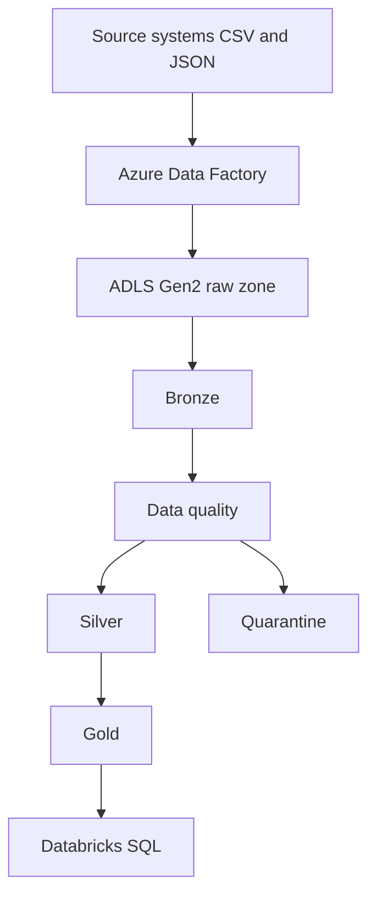

# End-to-End Data Engineering Pipeline with PySpark, Databricks & Azure

ShopSphere is a fictional e-commerce company. Its customer, product, order, and payment extracts do not share one schema or one definition of a valid row. This project builds a medallion pipeline that lands those files, quarantines bad records, and publishes sales tables for SQL.

The sample is synthetic. Azure resources in this repository are a deployment design. They were not created in a subscription, and the pipeline has not been run in a Databricks workspace.

## Project overview

The pipeline is a batch ELT job:

1. Read CSV and newline-delimited JSON with explicit schemas.
2. Write Bronze with ingestion time, source file, and source system.
3. Apply data-quality rules and write failures to Quarantine.
4. Write typed, de-duplicated Silver tables.
5. Aggregate recognized orders into Gold.
6. Merge a later order batch and rebuild Gold.
7. Write a quality report, pipeline metrics, and run the SQL scripts.

## Business problem

Analysts should not have to guess which customer row is the duplicate, which order status is real, or which payment line failed to parse. The operational systems can stay relational. The lakehouse is the place that keeps history, rejected rows, and the metrics used for reporting.

## Architecture



Local execution uses the same stages on disk. ADF and ADLS are the cloud shape of the ingest and storage steps. See [docs/architecture.md](docs/architecture.md).

## Tech stack

| Technology | Role in this project |
| --- | --- |
| Python | Pipeline, configuration, tests |
| PySpark / Apache Spark | DataFrame transforms, joins, aggregations |
| Databricks | Notebook entry points and the intended Spark runtime |
| Azure Data Factory | Designed orchestrator for copy plus notebook activities |
| ADLS Gen2 | Designed lake layout |
| Delta Lake | Cloud table format and MERGE path |
| Parquet | Local table format |
| CSV / JSON | Source extracts |
| SQL | Analytics queries |
| pytest | Unit and end-to-end tests |
| GitHub Actions | Compile and test on every push |

## Data sources

| File | Approx. rows | Grain |
| --- | --- | --- |
| `data/raw/customers.csv` | 500+ | Customer |
| `data/raw/products.csv` | 200+ | Product |
| `data/raw/orders.csv` | 2,000+ | Order |
| `data/raw/order_items.csv` | 5,000+ | Order line |
| `data/raw/payments.json` | 2,000+ | Payment, one JSON object per line |

Most foreign keys resolve. A smaller set is intentionally dirty: missing emails, duplicate keys, invalid dates and statuses, bad prices and quantities, unknown categories, orphan keys, and malformed JSON lines. `scripts/generate_sample_data.py` regenerates the files with seed 42.

`data/sample/late_orders.csv` is a second batch used by the incremental step.

## Medallion architecture

| Layer | Contract |
| --- | --- |
| Bronze | Source values plus ingestion metadata. Orders are partitioned by `order_year`. |
| Silver | One valid row per business key, typed columns, standardized geography and status. |
| Gold | Daily, monthly, customer, product, category, and payment aggregates. |
| Quarantine | Rejected rows and the rules they failed. |

Column definitions are in [docs/data_dictionary.md](docs/data_dictionary.md).

## Data quality

Rules cover nulls, types, ranges, dates, allowed values, duplicates, foreign keys, and one business rule: an order cannot be dated before the customer signed up. Several errors can be stored on one row.

`USA` and `tx` are standardized, not rejected. A blank discount becomes 0. Details and error codes are in [docs/data_quality.md](docs/data_quality.md).

The report `data_quality_report.csv` is written by the pipeline and is not committed.

## Azure architecture

```text
Azure Data Factory
    -> ADLS Gen2 raw/
    -> Databricks notebooks
    -> Delta Bronze, Silver, Gold, Quarantine
    -> Databricks SQL
```

The container layout is in [azure/adls/storage-layout.md](azure/adls/storage-layout.md). Paths come from `AZURE_ADLS_BASE_PATH` or from `AZURE_STORAGE_ACCOUNT` and `AZURE_CONTAINER`. There are no credentials in the repository.

Access in the design uses a managed identity. A token, if one is required, belongs in Key Vault. See [docs/deployment.md](docs/deployment.md).

## ADF orchestration

Pipeline name: `pl_shopsphere_medallion`.

Copy activities land the five sources in parallel. Bronze starts after all copies succeed. Silver, Gold, and the SQL notebook run in order. Copy activities retry three times. A notebook failure fails the factory pipeline. Quarantine rows do not.

The design, datasets, linked services, and a JSON sketch are under [azure/adf/](azure/adf/). The JSON file is a template, not a deployed pipeline.

## Databricks processing

Notebooks:

| Notebook | Stage |
| --- | --- |
| `notebooks/01_bronze_ingestion.py` | Bronze |
| `notebooks/02_data_quality.py` | Rule review |
| `notebooks/03_silver_transformations.py` | Silver and Quarantine |
| `notebooks/04_gold_transformations.py` | Gold |
| `notebooks/05_spark_optimization.py` | Join plans |
| `notebooks/06_databricks_sql.py` | SQL scripts |

They call the modules in `src/`. Import them with Databricks Repos or as workspace files. Run 01, 03, 04, then 06. Use a development cluster to explore and a job cluster for a scheduled ADF run.

## Spark optimization

The sample is small, so the project does not invent a speedup number. It does prune columns, filter before the incremental merge, broadcast customer and product lookups, avoid Python UDFs, and cache the Gold fact only while the six aggregates run.

[optimization/spark-optimization.md](optimization/spark-optimization.md) explains shuffle, broadcast, predicate pushdown, and `repartition` versus `coalesce`. Notebook 05 prints a broadcast plan and a shuffle plan. On a laptop the broadcast side can be slower. That is a real property of a tiny join, not a reason to broadcast a large fact table.

## Delta Lake

Delta is the format when `PIPELINE_STORAGE_FORMAT=delta`, which is the default on Databricks and when `ENVIRONMENT=azure`.

The incremental step uses `DeltaTable.merge` for matched updates and new inserts. Local Parquet does the same logical upsert by keeping the newest key and overwriting the table. Schema overwrite is enabled on full refreshes so a development rerun can evolve columns. Schema enforcement, OPTIMIZE, VACUUM, and time travel are documented as production Delta practice in [optimization/databricks-optimization.md](optimization/databricks-optimization.md). Those maintenance commands were not run here.

## Gold tables

Revenue uses orders in `CONFIRMED`, `SHIPPED`, or `DELIVERED`. `PENDING` and `CANCELLED` stay in Silver and are excluded from Gold sales.

```text
gross_sales = quantity * unit_price
discount_amount = gross_sales * discount / 100
net_sales = gross_sales - discount_amount
```

| Table | Grain |
| --- | --- |
| `daily_sales` | date, orders, items, gross, discount, net, average order value |
| `customer_sales_summary` | customer spend, orders, first and last order |
| `product_sales_summary` | product units and revenue |
| `category_sales_summary` | category orders, units, revenue |
| `payment_summary` | method, successful payments, failed payments, successful amount |
| `monthly_sales_summary` | year, month, orders, revenue, average order value |

`PAID` and `COMPLETED` count as successful payments. `DECLINED` counts as failed. Pending and refunded payments are neither.

## SQL analytics

The scripts in `sql/` are Spark SQL and Databricks SQL compatible:

- Top 10 customers and products by revenue
- Monthly and daily revenue
- Revenue by category
- Average order value
- Purchase frequency
- Cancelled-order percentage
- Payment success rate
- Customers with no orders
- Best-selling products
- Month-over-month change and revenue growth
- A simple realized customer value, labeled as an approximation rather than a predictive model

Example:

```sql
SELECT
    customer_id,
    total_spend,
    total_orders,
    average_order_value
FROM customer_sales_summary
ORDER BY total_spend DESC
LIMIT 10;
```

## Incremental processing

After the full load, the job reads the late-order sample, keeps rows with `order_date` newer than the checkpoint, validates them, and upserts them into Silver. The checkpoint is `data/checkpoints/orders_watermark`. Gold is then rebuilt.

This watermark cannot see a status correction on an older order. A production feed should carry `updated_at` or change data capture. That limitation is intentional and documented.

## Monitoring

`pipeline_metrics.csv` records, for each dataset and for the whole run:

- pipeline start and end
- input, valid, and invalid counts
- duration
- `SUCCESS` or `FAILED`

The pipeline logs stage starts, row counts, output paths, and exceptions through the `logging` module. Logs go to the console and to `logs/pipeline.log`.

## Testing

`pytest` covers nulls, duplicates, email, price, quantity, status, foreign keys, revenue math, standardization, the Parquet upsert, Gold's exclusion of cancelled orders, and a tiny end-to-end run. Tests do not need Azure.

## CI/CD

[`.github/workflows/ci.yml`](.github/workflows/ci.yml) installs JDK 17 and Python 3.12, compiles the packages, and runs pytest. It does not deploy to Azure. That is basic CI, not a release pipeline.

## Project structure

```text
src/                 Pipeline code: ingest, quality, silver, gold, incremental, monitoring
notebooks/           Databricks notebook sources
sql/                 Analytics queries
azure/               ADF and ADLS design
optimization/        Spark and Databricks notes
tests/               pytest
docs/                Architecture, dictionary, quality, deployment, interview notes
data/raw             Sample extracts, committed
data/sample          Incremental batch, committed
data/bronze|silver|gold|quarantine   Generated, gitignored
```

## Local setup

Install [JDK 17](https://adoptium.net/) and set `JAVA_HOME`. Python 3.11 or 3.12 is required. Use a python.org CPython install on Windows. The Microsoft Store alias breaks Spark workers. The project pins PySpark 3.5.9 because earlier 3.5 releases lose buffered worker output on Windows with Python 3.12 ([SPARK-53759](https://issues.apache.org/jira/browse/SPARK-53759)). On Windows, the first local Spark write downloads `winutils.exe` into `.hadoop/` when `HADOOP_HOME` is unset. That folder is gitignored.

Windows:

```text
python -m venv .venv
.venv\Scripts\activate
pip install -r requirements.txt
python -m src.pipeline
pytest
```

macOS or Linux:

```text
python -m venv .venv
source .venv/bin/activate
pip install -r requirements.txt
python -m src.pipeline
pytest
```

The local master defaults to `local[2]`. That keeps a laptop from starting one Python worker per core. Set `SPARK_MASTER=local[*]` when you want every core.

Optional environment variables, also listed in `.env.example`:

```text
ENVIRONMENT=local
PIPELINE_STORAGE_FORMAT=parquet
PIPELINE_BASE_PATH=
```

`python -m src.pipeline` prints log lines for ingestion, Silver, Gold, the incremental batch, SQL row counts, and completion. Generated tables are under `data/`. The quality report and metrics CSV appear in the repository root.

One local Parquet run of the committed sample produced these quality counts. They describe the sample files only.

| Dataset | Input | Valid | Quarantined |
| --- | ---: | ---: | ---: |
| customers | 518 | 459 | 59 |
| products | 220 | 185 | 35 |
| orders | 2,025 | 1,908 | 117 |
| order_items | 5,050 | 4,807 | 243 |
| payments | 2,033 | 1,923 | 110 |

The payments input includes the malformed JSON lines. After the incremental batch, Gold had 671 daily rows, 459 customer summaries, 185 product summaries, 7 category rows, 5 payment-method rows, and 28 monthly rows.

## Databricks setup

1. Import the repo into Databricks Repos.
2. Create a cluster on DBR 13.3 LTS or newer.
3. Set `ENVIRONMENT=azure`, `PIPELINE_STORAGE_FORMAT=delta`, and the ADLS base path.
4. Put the raw files in the `raw/` prefix.
5. Run notebooks 01, 03, 04, and 06.
6. Query `daily_sales` and the other Gold views from notebook 06 or from Databricks SQL after `saveAsTable`.

You can read the notebooks without an Azure login. Running them in the cloud requires a workspace.

## Azure architecture setup

Follow [docs/deployment.md](docs/deployment.md) and [azure/adf/pipeline-design.md](azure/adf/pipeline-design.md). Create the storage account, container, factory, and workspace yourself if you want to deploy the design. This repository does not do that for you.

## Example queries

```sql
SELECT category, revenue
FROM category_sales_summary
ORDER BY revenue DESC;

SELECT
    year,
    month,
    total_revenue,
    ROUND(
        (total_revenue - LAG(total_revenue) OVER (ORDER BY year, month))
        / NULLIF(LAG(total_revenue) OVER (ORDER BY year, month), 0) * 100,
        2
    ) AS revenue_growth_percentage
FROM monthly_sales_summary
ORDER BY year, month;
```

## Concepts demonstrated

ETL/ELT, PySpark, distributed DataFrame transforms, medallion architecture, schema validation, data quality, quarantine, Delta MERGE and a Parquet upsert, Parquet, CSV, JSON, SQL, partitioning, logging, testing, Git, a basic GitHub Actions workflow, and a cloud design for ADF and ADLS.

## Future improvements

These are not implemented:

- A deployed ADF factory and alerts
- Unity Catalog table registration
- An `updated_at` or CDC watermark
- Payment-to-order amount reconciliation
- Incremental Gold instead of a full rebuild
- OPTIMIZE and VACUUM on a real Delta table
- Streaming ingestion
- A release workflow that publishes notebooks

Interview notes for these choices are in [docs/interview-guide.md](docs/interview-guide.md).
