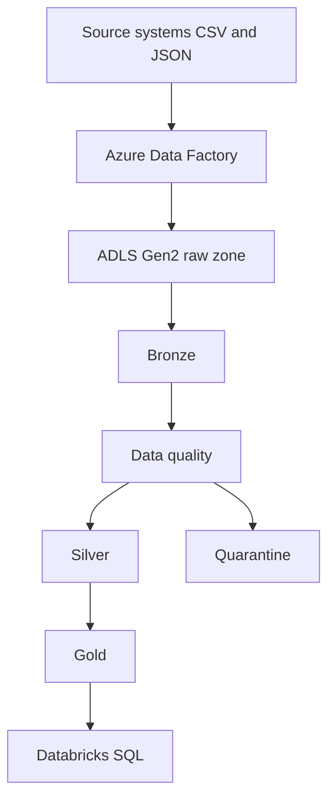

# Architecture

ShopSphere needs one analytics path for customers, products, orders, order lines, and payments. The operational systems stay where they are. This project lands extracts, checks them, and publishes tables that SQL can query.

## Local and cloud

| | Local | Azure / Databricks |
| --- | --- | --- |
| Orchestration | `python -m src.pipeline` | ADF pipeline design in `azure/adf/` |
| Storage | `data/` on disk | ADLS Gen2 paths from environment variables |
| Table format | Parquet by default | Delta when `PIPELINE_STORAGE_FORMAT=delta` |
| Secrets | None | Managed identity and Key Vault, documented only |

The transformation code does not branch into a second business implementation. Only the path and the file format change.

## Medallion layers

Bronze is the source plus ingestion metadata. It still contains bad emails, duplicate keys, and broken JSON lines.

Silver is the trusted relational shape: typed columns, one row per business key, and foreign keys that point at surviving parents.

Gold is the reporting shape. It answers daily sales, customer spend, product revenue, category revenue, payments, and monthly trend without repeating the join logic.

## How this relates to an RDBMS

A PostgreSQL or MySQL database would be the operational system of record: normalized tables, transactions, and indexes for the application. Analytics queries on that database compete with checkout traffic.

The usual pattern is:

1. The application writes orders to the operational database.
2. ADF copies changed extracts, or the database exports CSV and JSON.
3. The lakehouse keeps history, quality results, and aggregates.
4. Databricks SQL reads Gold. It does not replace the operational database.

This repository starts at step 2, with files that stand in for those extracts. It does not run PostgreSQL.

## Incremental load

The full pipeline processes the raw batch, then reads `data/sample/late_orders.csv`. A checkpoint stores the maximum `order_date` already in Silver orders. Only later dates are validated and merged.

- Delta: `MERGE` on `order_id` or `order_item_id`
- Parquet: read the current table, keep the newest row per key, and overwrite

Gold is rebuilt from Silver after the merge. That is a full aggregate refresh, which is simple and correct at this size. A production fact table would update only the affected dates.

The watermark is `order_date`, not an `updated_at` column. A status change on an old order is not picked up. A real CDC feed would use a change timestamp or log.

## Formats

| Format | Role |
| --- | --- |
| CSV | Customer, product, order, and order-item extracts |
| JSON | Payments, including a few malformed lines |
| Parquet | Columnar files for local Bronze, Silver, and Gold |
| Delta | ACID tables, schema enforcement, and MERGE on Databricks |

## Security

- No account keys, tokens, or passwords are stored in Git.
- `.env` is ignored. `.env.example` lists variable names only.
- Azure access in the design uses a managed identity with access to one container.
- Key Vault is the place for any remaining secret. The notebooks never print secrets.
- Least privilege means the Factory identity can write `raw/`, and the Databricks identity can read `raw/` and write the curated zones.
